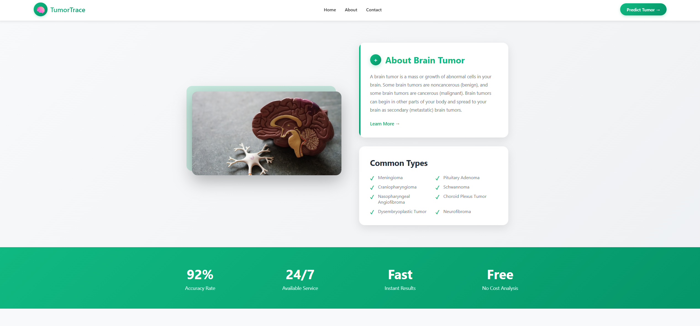

# TumorTrace 🧠

AI-powered Brain Tumor Detection System using Deep Learning



## Features

- 🎯 **High Accuracy**: 92% accuracy rate in brain tumor detection
- ⚡ **Fast Analysis**: Get instant results within seconds
- 🔒 **Secure & Private**: Your medical data is processed securely
- 📱 **Responsive Design**: Works on all devices
- 👨‍⚕️ **Doctor Consultation**: Direct links to book appointments with specialists

## Tech Stack

- **Backend**: Flask (Python)
- **ML Model**: TensorFlow/Keras VGG Model
- **Frontend**: HTML, CSS, JavaScript
- **Deployment**: Render/Railway

## Installation

### Prerequisites
- Python 3.9+
- pip

### Setup

1. Clone the repository:
```bash
git clone https://github.com/Rounak-gupta007/TumorTrace.git
cd TumorTrace
```

2. Create a virtual environment:
```bash
python -m venv .venv
.venv\Scripts\activate  # Windows
source .venv/bin/activate  # Linux/Mac
```

3. Install dependencies:
```bash
pip install -r requirements.txt
```

4. **Important**: Download the VGG model file:
   - The `VGG_model.h5` file is too large for GitHub (384MB)
   - Download it from: [https://drive.google.com/file/d/1tlhLq5mckwAfvjxedOIjEnx21eUjX7MJ/view?usp=sharing]
   - Place it in the root directory of the project

5. Run the application:
```bash
python app.py
```

6. Open your browser and navigate to:
```
http://127.0.0.1:5000
```

## Usage

1. Navigate to the home page
2. Click "Predict Tumor" button
3. Upload an MRI brain scan image (JPG, JPEG, PNG)
4. Click "Upload" to analyze
5. View results with confidence percentage

## Project Structure

```
TumorTrace/
├── app.py                 # Main Flask application
├── util.py               # Utility functions for model
├── model.py              # Model training script
├── VGG_model.h5          # Trained model (not in repo)
├── templates/            # HTML templates
│   ├── index.html        # Home page
│   ├── about.html        # About page
│   ├── predict.html      # Upload page
│   └── success.html      # Results page
├── static/               # Static files
│   ├── css/             # Stylesheets
│   ├── images/          # Images
│   ├── upload/          # Uploaded images
│   └── predict/         # Prediction results
├── requirements.txt      # Python dependencies
├── Procfile             # Deployment configuration
└── runtime.txt          # Python version

```

## Model Information

- **Architecture**: VGG (Visual Geometry Group)
- **Framework**: TensorFlow/Keras
- **Input**: MRI brain scan images
- **Output**: Binary classification (Tumor/No Tumor) with confidence score
- **Accuracy**: ~92%

## Screenshots

### Home Page
Modern landing page with information about brain tumors and doctor consultation links.

### Prediction Page
Clean interface for uploading MRI scans.

### Results Page
Displays prediction results with confidence percentage.

## Team

- **Rounak Gupta** - [GitHub](https://github.com/Rounak-gupta007) | [LinkedIn](https://www.linkedin.com/in/rounakgupta7/)
- **Ayush Patel** - [GitHub](https://github.com/Ayush181818) | [LinkedIn](https://www.linkedin.com/in/ayush-patel2)

## Disclaimer

⚠️ **Medical Disclaimer**: This tool is for educational and research purposes only. It should NOT be used as a substitute for professional medical advice, diagnosis, or treatment. Always consult with qualified healthcare professionals for medical decisions.

## Acknowledgments

- Dataset: Brain MRI Images for Brain Tumor Detection
- Model Architecture: VGG Network
- Inspiration: Early detection saves lives

---

Made with ❤️ by Rounak Gupta & Ayush Patel

© 2025 TumorTrace. All rights reserved.
